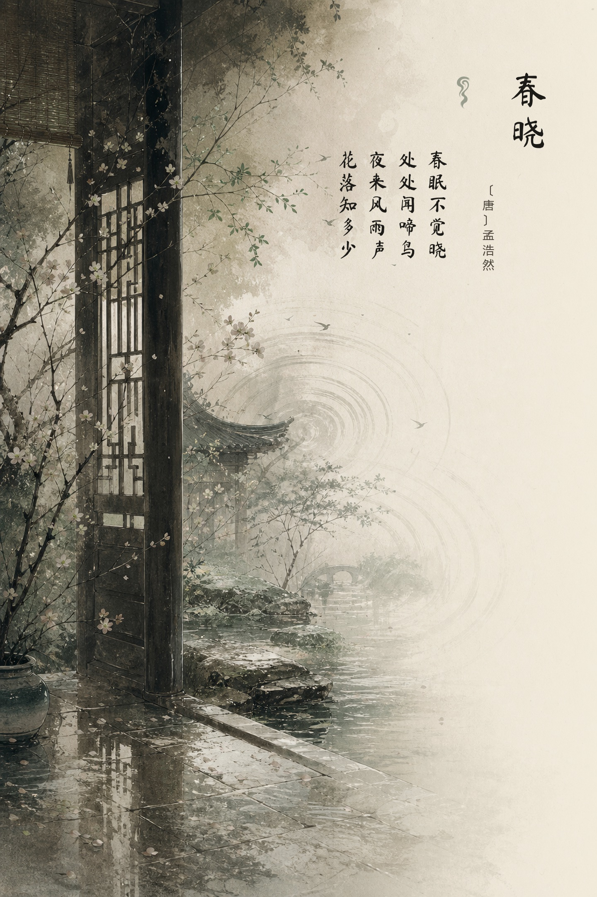
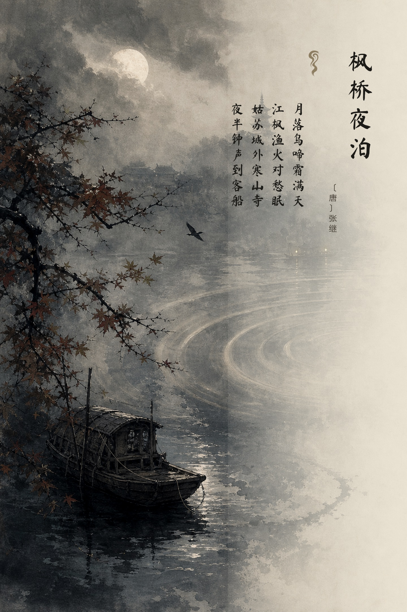
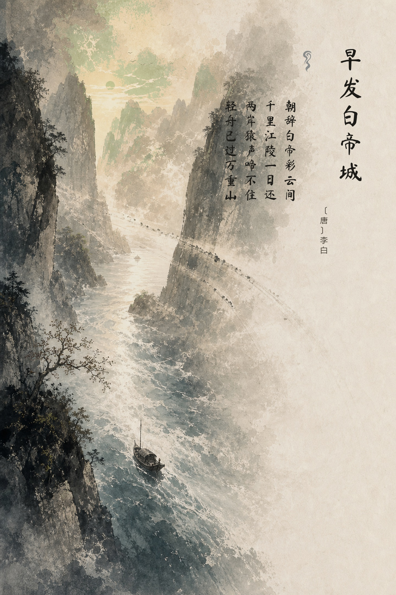
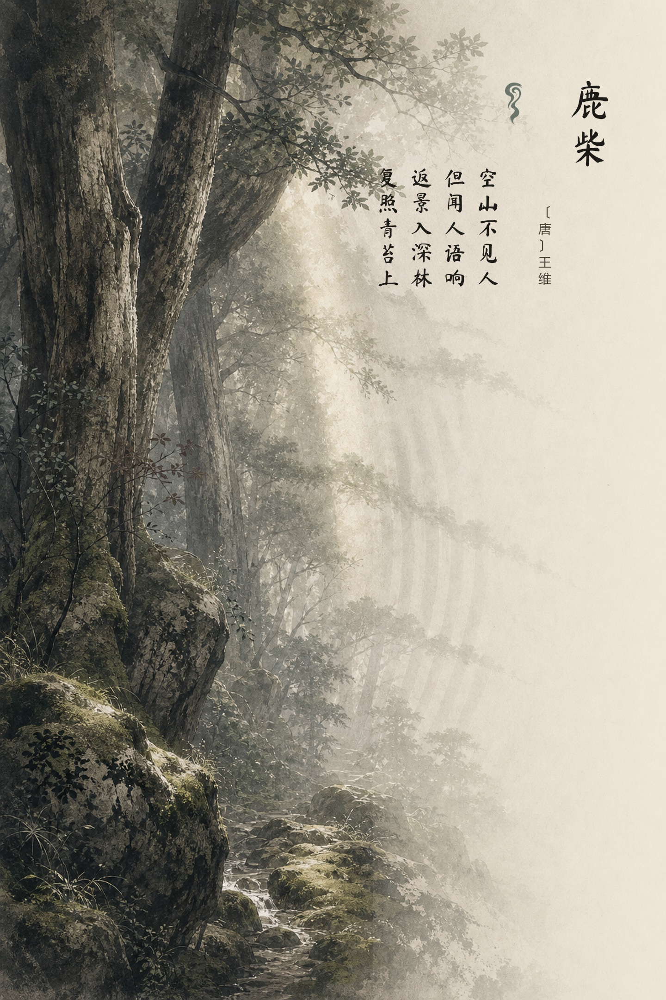
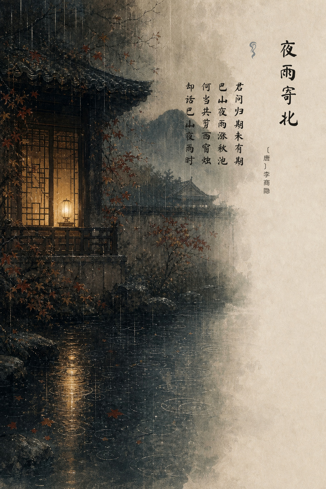

<div align="center">

# 🎨 声入诗境

### *古典诗词中不可见声音的 AIGC 视觉转译*

**让不可见的声音穿过五重诗境**

[](https://www.ncda.org.cn)
[](https://python.org)
[](https://pillow.readthedocs.io)
[](https://github.com/black-forest-labs/flux)

---

</div>


<div align="center">
<sub>▲ A3 竖版宣传海报（3508×4961，300dpi）· 金色声波漩涡 · 水墨山水意境</sub>
</div>

---

## 📖 作品简介

> 作品选取 **鸟鸣、钟声、猿啼、人语回响与夜雨** 五种声音，以声波的扩散、回返、断续、叠加和消隐转化为画面构图规则，将听觉经验转译为东方空间。

本项目面向 **未来设计师·全国高校数字艺术设计大赛（NCDA）** 非命题赛道 **1-L1 AIGC-图片类** 完成。AIGC 用于生成无文字诗境底图，主题策划、候选筛选、色彩统一、声音线索、传统竖排、印章、宣传海报和过程编排均由人工完成。

---

## 🖼️ 系列作品展示

<table>
  <tr>
    <td align="center"><b>01 · 春晓</b><br><sub>🐦 鸟鸣</sub></td>
    <td align="center"><b>02 · 枫桥夜泊</b><br><sub>🔔 钟声</sub></td>
    <td align="center"><b>03 · 早发白帝城</b><br><sub>🐒 猿啼</sub></td>
    <td align="center"><b>04 · 鹿柴</b><br><sub>🗣️ 人语回响</sub></td>
    <td align="center"><b>05 · 夜雨寄北</b><br><sub>🌧️ 夜雨</sub></td>
  </tr>
  <tr>
    <td></td>
    <td></td>
    <td></td>
    <td></td>
    <td></td>
  </tr>
  <tr>
    <td align="center"><sub>〔唐〕孟浩然</sub></td>
    <td align="center"><sub>〔唐〕张继</sub></td>
    <td align="center"><sub>〔唐〕李白</sub></td>
    <td align="center"><sub>〔唐〕王维</sub></td>
    <td align="center"><sub>〔唐〕李商隐</sub></td>
  </tr>
</table>

---

## 📦 提交成果

```
submission/
├── 🖼️ works/                          # 5 张系列 JPG（1440×2160，300dpi）
├── 🎨 a3_poster.jpg                   # A3 竖版宣传海报（3508×4961，300dpi）
├── 📄 process/creation_process.pdf    # 创作过程说明 PDF
├── 🎬 video/声入诗境_宣讲视频.mp4       # 96 秒宣讲视频（1080p，H.264 + AAC）
├── 📝 video/narration_script.md       # 中文宣讲稿
├── 📋 PLATFORM_COPY.md                # 平台投稿文案
└── 📊 submission_manifest.json        # 文件尺寸、大小与生成信息
```

> 📌 GitHub 用于作品、源图、过程证据和构建工具备份。正式报名仍需通过 NCDA 平台并由学校管理员审核。

---

## ✨ 作品创新点

| 维度 | 说明 |
|:---:|------|
| 🏛️ **文化输入可解释** | 以古典诗词文本为源头，保留题名、作者、朝代、意象与情绪 |
| 🔍 **生成过程可追溯** | 每张作品保存结构化 JSON，记录模型、Prompt 和生成时间 |
| 🎨 **人工设计介入明确** | 程序化排版控制竖排文字、挂轴、印章、留白与 A3 宣传版式 |
| 🎯 **系列视觉统一** | 统一水墨质感、宣纸肌理、传统构图和东方留白 |
| 🔇 **匿名评审友好** | 宣传海报默认不包含作者、学校、指导教师等信息 |

---

## 🏆 参赛定位

<table>
  <tr>
    <td>🏅 <b>赛事</b></td>
    <td>未来设计师·全国高校数字艺术设计大赛（NCDA）</td>
  </tr>
  <tr>
    <td>🛤️ <b>赛道</b></td>
    <td>非命题赛道</td>
  </tr>
  <tr>
    <td>📂 <b>类别</b></td>
    <td>1-L1 AIGC-图片类</td>
  </tr>
  <tr>
    <td>🖼️ <b>作品形式</b></td>
    <td>5 张成系列 JPG 图片 + A3 宣传海报</td>
  </tr>
  <tr>
    <td>📄 <b>过程材料</b></td>
    <td>创作过程 PDF + JSON 过程日志</td>
  </tr>
</table>

> ⚠️ 正式提交前请以当届 NCDA 官网与学校通知为准。项目内的 `NCDA_SUBMISSION_GUIDE.md` 提供了更完整的提交整理说明。

---

## 🔧 技术管线

```
古典诗词 ──→ LLM 意象解析 ──→ Prompt 生成 ──→ AIGC 文生图 ──→ 程序化排版 ──→ 系列作品
   📜              🧠              ✍️              🎨              🖌️           🖼️
```

本项目通过 **LLM 解析古典诗词意象**、调用云端文生图 API（FLUX.1），再使用 **Python + Pillow** 进行程序化排版，形成完整的 AIGC 创作管线。

---

## 🚀 快速开始

### 1️⃣ 安装依赖

```bash
pip install -r requirements.txt
```

### 2️⃣ 配置 API

复制 `.env.example` 为 `.env`，填写 LLM 和文生图 API Key：

```bash
cp .env.example .env
```

<details>
<summary>📋 示例配置（点击展开）</summary>

```env
LLM_API_KEY=your_llm_api_key_here
LLM_BASE_URL=https://api.deepseek.com/v1
LLM_MODEL=deepseek-chat

T2I_PROVIDER=siliconflow
T2I_API_KEY=your_t2i_api_key_here
T2I_MODEL=black-forest-labs/FLUX.1-schnell
```

</details>

### 3️⃣ 单张生成

```bash
python main.py --poetry "床前明月光，疑是地上霜。举头望明月，低头思故乡。" --make_a3
```

输出：`poetry_poster.jpg` · `poetry_poster_a3.jpg` · `poetry_poster_process.json`

### 4️⃣ 系列生成（推荐用于 NCDA）

```bash
python main.py --poetry_file poems_sample.txt --series_output outputs/ncda_series
```

<details>
<summary>📁 输出结构（点击展开）</summary>

```
outputs/ncda_series/
├── works/               # 5 张或以上系列作品图
├── a3_posters/          # A3 竖版宣传海报
├── backgrounds/         # 文生图底图
├── process/             # 单张与系列 JSON 过程日志
└── process_report.md    # 创作过程报告草稿
```

</details>

---

## ✅ 提交前检查

### 🔍 自动检查

```bash
# 正式作品检查
python ncda_check.py --dir submission

# 重建完整提交包
python build_competition_package.py

# 本地排版验证（不消耗 API Token）
python verify_typesetting.py
```

检查器验证：作品数量和大小 · A3 尺寸与 DPI · 过程 PDF · 平台文案 · 提交清单 · MP4 时长/编码

### 📝 人工检查清单

- [ ] 系列作品不少于 5 张
- [ ] JPG 单张不超过 5 MB
- [ ] 宣传海报为 A3 竖版、300dpi、JPG
- [ ] 作品中不含参赛作者、指导教师、学校名称
- [ ] `process_report.md` 已补充生成截图并导出 PDF
- [ ] 最终提交前查看当届 NCDA 官网与学校通知

---

## 📂 项目结构

```
NCDA_poetry_AIGC/
├── 🐍 main.py                      # 主生成管线
├── 🏗️ build_competition_package.py  # 竞赛提交包构建器
├── ✅ ncda_check.py                 # NCDA 提交前检查脚本
├── 🖌️ verify_typesetting.py         # 本地排版验证脚本
├── 📖 NCDA_SUBMISSION_GUIDE.md      # NCDA 参赛提交指南
├── 📜 poems_sample.txt              # 系列生成示例诗词
├── 📦 requirements.txt              # Python 依赖
├── 🔑 .env.example                  # API 配置模板
├── 📁 assets/                       # 字体、源图、设计素材
├── 📁 submission/                   # 正式提交文件
└── 📖 README.md
```

---

<div align="center">

**Made with ❤️ for NCDA AIGC Design**

*声入诗境 · 鸟鸣 · 钟声 · 猿啼 · 人语回响 · 夜雨*

</div>
