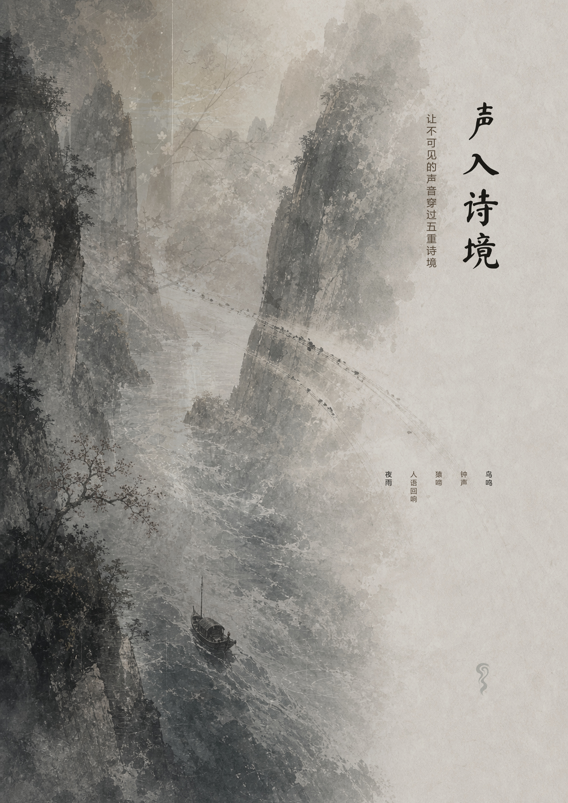

# 诗境再造：古典诗词意象的 AIGC 视觉转译系统

## 正式参赛作品：《声入诗境》

面向 **未来设计师·全国高校数字艺术设计大赛（NCDA）非命题赛道 1-L1 AIGC-图片类** 完成的系列视觉作品。

作品选取鸟鸣、钟声、猿啼、人语回响与夜雨五种声音，把声音的扩散、回返、断续、叠加和消隐转化为画面构图。AIGC 用于生成无文字诗境底图，主题策划、候选筛选、色彩统一、声音线索、传统竖排、印章、宣传海报和过程编排由人工完成。



### 正式提交成果

```text
submission/
├── works/                         # 5 张系列 JPG，1440x2160、300dpi
├── a3_poster.jpg                  # A3 竖版宣传海报，3508x4961、300dpi
├── process/creation_process.pdf   # 8 页创作过程说明
├── video/声入诗境_宣讲视频.mp4      # 96 秒、1080p、H.264 + AAC
├── video/narration_script.md      # 中文宣讲稿
├── PLATFORM_COPY.md               # 平台投稿文案
└── submission_manifest.json       # 文件尺寸、大小与生成信息
```

五张作品依次表现《春晓》的鸟鸣、《枫桥夜泊》的钟声、《早发白帝城》的猿啼、《鹿柴》的人语回响和《夜雨寄北》的夜雨。

GitHub 用于作品、源图、过程证据和构建工具备份。正式报名仍需通过 NCDA 平台并由学校管理员审核。

### 重建与检查

需要 Python 3.9+、Pillow 和 FFmpeg。Windows 上如果安装了 Microsoft Huihui 中文语音，构建器会自动生成中文旁白。

```bash
python build_competition_package.py
python ncda_check.py --dir submission
```

检查器验证作品数量和大小、A3 尺寸与 DPI、过程 PDF、平台文案、提交清单，以及 MP4 的时长、1080p H.264 视频流和 AAC 音轨。

---

## 原始生成工具

本项目也保留了通过 **LLM 解析古典诗词意象**、调用云端文生图 API，再使用 **Python + Pillow** 进行程序化排版的原始生成管线。

---

## 参赛定位

- **推荐赛事**：未来设计师·全国高校数字艺术设计大赛（NCDA）
- **推荐赛道**：非命题赛道
- **推荐类别**：1-L1 AIGC-图片类
- **作品形式**：5 张或以上成系列 JPG 图片
- **过程材料**：自动生成 JSON 过程日志与 `process_report.md`，可整理为创作过程 PDF
- **宣传材料**：自动生成 A3 竖版 300dpi JPG 宣传海报

> 正式提交前请以当届 NCDA 官网与学校通知为准。项目内的 `NCDA_SUBMISSION_GUIDE.md` 提供了更完整的提交整理说明。

---

## 项目特点

- **传统文化主题**：以古典诗词为输入，围绕意象、情绪、空间与东方审美进行视觉转译。
- **AIGC 生成链路完整**：包含诗词解析、Prompt 生成、文生图、程序化排版、过程记录。
- **系列化输出**：支持一次生成 5 张或以上系列作品，适合 AIGC 图片类提交。
- **匿名评审友好**：宣传海报默认不包含作者、学校、指导教师等信息。
- **提交前检查**：提供 `ncda_check.py` 检查作品数量、JPG 大小、A3 海报、过程材料等。

---

## 安装

```bash
pip install -r requirements.txt
```

复制 `.env.example` 为 `.env`，填写 LLM 和文生图 API Key。

```bash
cp .env.example .env
```

示例配置：

```env
LLM_API_KEY=your_llm_api_key_here
LLM_BASE_URL=https://api.deepseek.com/v1
LLM_MODEL=deepseek-chat

T2I_PROVIDER=siliconflow
T2I_API_KEY=your_t2i_api_key_here
T2I_MODEL=black-forest-labs/FLUX.1-schnell
```

---

## 单张生成

```bash
python main.py --poetry "床前明月光，疑是地上霜。举头望明月，低头思故乡。" --make_a3
```

输出：

- `poetry_poster.jpg`
- `poetry_poster_a3.jpg`
- `poetry_poster_process.json`

---

## 系列生成（推荐用于 NCDA）

```bash
python main.py --poetry_file poems_sample.txt --series_output outputs/ncda_series
```

输出结构：

```text
outputs/ncda_series/
  works/               # 5 张或以上系列作品图
  a3_posters/          # A3 竖版宣传海报
  backgrounds/         # 文生图底图
  process/             # 单张与系列 JSON 过程日志
  process_report.md    # 创作过程报告草稿，可补图后导出 PDF
```

---

## 本地排版验证

不消耗 API Token，仅验证字体、挂轴排版和图片输出：

```bash
python verify_typesetting.py
```

---

## 旧版系列目录检查

旧版 `outputs/ncda_series` 目录仍可检查：

```bash
python ncda_check.py --dir outputs/ncda_series
```

如果要检查文件名中是否出现作者、学校、指导老师等匿名评审不建议出现的信息：

```bash
python ncda_check.py --dir outputs/ncda_series --forbidden 你的姓名 学校名 指导老师名
```

正式作品请优先运行 `python ncda_check.py --dir submission`。旧版目录检查包括：

- 系列作品是否不少于 5 张
- JPG 单张是否不超过 5MB
- A3 宣传海报是否接近 297mm × 420mm、300dpi
- 是否存在 `process_report.md`
- 是否存在过程 JSON 记录
- 文件名中是否出现指定的匿名评审敏感词

---


## 提交前人工检查

- 系列作品不少于 5 张。
- JPG 单张建议不超过 5MB。
- 宣传海报为 A3 竖版、300dpi、JPG。
- 作品图、宣传海报、过程报告、演示视频中尽量不要出现参赛作者、指导教师、学校名称。
- 将 `process_report.md` 补充生成截图、Prompt 迭代截图、筛选说明后导出为 PDF。
- 最终提交前再次查看当届 NCDA 官网和学校通知，确认上传入口、命名规范、文件大小和补充材料要求。

---

## 目录说明

```text
NCDA_poetry_AIGC/
├── main.py                          # 主生成管线（诗词解析 → 文生图 → 排版）
├── build_competition_package.py     # NCDA 参赛包构建器（作品、海报、PDF、视频）
├── build_process_pdf_v2.py          # 创作过程 PDF 生成器（12 页排版）
├── ncda_check.py                    # NCDA 提交前检查脚本
├── verify_typesetting.py            # 本地排版验证（不消耗 API）
├── poems_sample.txt                 # 系列生成示例诗词
├── requirements.txt                 # Python 依赖
├── .env.example                     # API 配置模板
├── NCDA_SUBMISSION_GUIDE.md         # NCDA 参赛提交指南
├── PROJECT_COMPETITION_ASSESSMENT.md # 参赛评估文档
├── assets/
│   ├── fonts/                       # 书法字体
│   ├── images/                      # 声景标识等图片素材
│   ├── redesign/                    # 重设计素材
│   └── series_sources/              # 五首诗的 AIGC 源图
├── submission/                      # 正式提交成果
│   ├── works/                       # 5 张系列作品 JPG
│   ├── a3_poster.jpg                # A3 竖版宣传海报
│   ├── process/creation_process.pdf # 12 页创作过程说明
│   ├── video/                       # 宣讲视频 + 解说稿
│   ├── PLATFORM_COPY.md             # 平台投稿文案
│   └── submission_manifest.json     # 提交清单
└── README.md
```

---

## 作品创新点

1. **文化输入可解释**：以古典诗词文本为源头，保留题名、作者、朝代、意象与情绪。
2. **生成过程可追溯**：每张作品保存结构化 JSON，记录模型、Prompt 和生成时间。
3. **人工设计介入明确**：通过程序化排版控制竖排文字、挂轴、印章、留白与 A3 宣传版式。
4. **系列视觉统一**：统一水墨质感、宣纸肌理、传统构图和东方留白。

---

**Made with ❤️ for NCDA AIGC Design**
